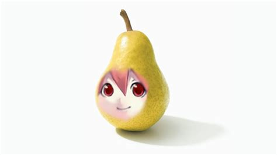

# Dxsh's Rivals Texture Pack

Custom **Roblox RIVALS texture pack** for **Fleasion**.



##  Installation

### 1. Download Fleasion

Download Fleasion from its **official GitHub Releases** page:

 https://github.com/fleasion/Fleasion/releases

Fleasion provides builds for **Windows and Linux/Sober**.

### 2. Download the texture pack

Download:

```text
Dxsh's-Rivals-texturepack.json
```

from this repository.

---

##  Windows

1. Open **Fleasion**.
2. Go to **Configs**.
3. Click **Open Configs**.
4. Copy and paste `Dxsh's-Rivals-texturepack.json` into the folder that opens.
5. Return to Fleasion.
6. Go to the **Enabled** tab.
7. Select/enable the texture pack.
8. **Clear the Roblox cache**.
9. Restart Roblox and launch **RIVALS**.

Done. Your textures should now be active.

---

##  Linux + Sober

Fleasion supports **Linux/Sober**.

The configs folder is:

```text
/home/YOUR_USER/.config/Fleasion/configs/
```

Replace `YOUR_USER` with your Linux username.

Example:

```text
/home/dxsh/.config/Fleasion/configs/
```

### Steps

1. Open **Fleasion**.
2. Go to **Configs**.
3. Click **Open Configs**.
4. Copy and paste `Dxsh's-Rivals-texturepack.json` into:

```text
/home/YOUR_USER/.config/Fleasion/configs/
```

5. Return to Fleasion.
6. Go to the **Enabled** tab.
7. Select/enable the texture pack.
8. **Clear the Roblox cache**.
9. Restart Sober/Roblox.
10. Launch **RIVALS**.

---

##  Troubleshooting

If the textures aren't showing:

* Make sure the JSON is inside the `configs` folder.
* Make sure the texture pack is enabled.
* Clear the Roblox cache.
* Restart Roblox/Sober.

Fleasion's `configs/` folder is specifically used for replacement configuration profiles in JSON format.

##  Repository

```text
Rivals-Textures-Fleasion/
├── Dxsh's-Rivals-texturepack.json
├── image.png
└── README.md
```

## 🔗 Links

**Fleasion:**
https://github.com/fleasion/Fleasion

**Fleasion Releases:**
https://github.com/fleasion/Fleasion/releases

**Texture Pack:**
https://github.com/Dxshrr/Rivals-Textures-Fleasion

---

Made by **Dxshrr**
